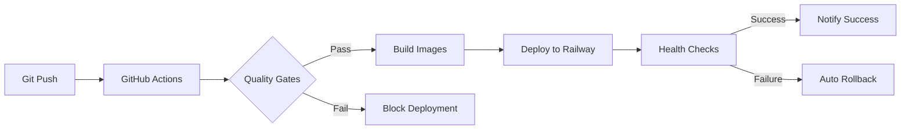

# 🚀 DevOps Strategy - Timestamped Token Reward System

## 📋 Executive Summary

This document presents a comprehensive CI/CD automation strategy designed for your Timestamped Token Reward System. The solution provides **git push → automatic deployment** with robust testing, security scanning, and rollback capabilities—perfect for learning DevOps while maintaining production-ready reliability.

## 🏗️ Recommended Architecture: GitHub Actions + Railway

### Why This Stack?

1. **🎯 Simplicity**: Railway offers zero-config deployments with excellent GitHub integration
2. **💰 Cost-Effective**: Free tiers suitable for learning and small projects
3. **📚 Learning Value**: Exposes industry-standard GitHub Actions practices
4. **⚡ Quick Setup**: Minimal configuration to get started
5. **📈 Scalable**: Easy migration path to more complex platforms

### Architecture Overview


## 🔧 Implementation Components

### 1. GitHub Actions Workflows

#### **CI Workflow** (`.github/workflows/ci.yml`)
- **Smart Change Detection**: Only tests/builds what changed
- **Quality Gates**: ESLint, Prettier, TypeScript checks
- **Automated Testing**: Jest/Vitest with database services
- **Container Building**: Multi-stage Docker builds with caching
- **Security Scanning**: Vulnerability and secret detection

#### **CD Workflow** (`.github/workflows/cd.yml`)
- **Sequential Deployment**: API first, then Web
- **Health Checks**: Comprehensive service validation
- **Integration Testing**: Post-deployment validation
- **Auto-Rollback**: Failure detection and recovery

#### **Security Workflow** (`.github/workflows/security-scan.yml`)
- **Dependency Scanning**: npm audit with vulnerability detection
- **Code Analysis**: CodeQL static analysis
- **Container Security**: Trivy image scanning
- **Environment Validation**: Configuration completeness checks

#### **Rollback Workflow** (`.github/workflows/rollback.yml`)
- **Manual Rollback**: Emergency rollback procedures
- **Backup Creation**: Pre-rollback state preservation
- **Incident Tracking**: Automatic issue creation
- **Validation Testing**: Post-rollback verification

### 2. Platform Configuration

#### **Railway Setup**
```bash
# API Service Configuration
Service: api
Root Directory: apps/api
Build Command: npm run build
Start Command: npm start
Health Check: /health
```

```bash
# Web Service Configuration
Service: web
Root Directory: apps/web
Build Command: npm run build
Start Command: nginx -g "daemon off;"
Health Check: /
```

### 3. Environment Management

#### **GitHub Secrets Required**
```bash
# Railway Integration
RAILWAY_TOKEN=rwy_xxx...

# Service URLs
API_HEALTH_URL=https://your-api.railway.app
WEB_HEALTH_URL=https://your-web.railway.app

# Build Variables
VITE_API_URL=https://your-api.railway.app/api
VITE_SOLANA_NETWORK=devnet
VITE_SOLANA_RPC_URL=https://api.devnet.solana.com
```

#### **Railway Environment Variables**
```bash
# API Service
NODE_ENV=production
JWT_SECRET=your-secure-256-bit-secret
SUPABASE_URL=https://your-project.supabase.co
SUPABASE_SERVICE_ROLE_KEY=eyJhbGci...
SOLANA_NETWORK=devnet
CORS_ORIGIN=https://your-web.railway.app

# Web Service
VITE_API_URL=https://your-api.railway.app/api
VITE_SOLANA_NETWORK=devnet
```

## 🎯 Key Features & Benefits

### ✅ Automated Quality Gates
- **Code Quality**: ESLint, Prettier, TypeScript validation
- **Security**: Dependency scanning, secret detection, container analysis
- **Testing**: Unit, integration, and component tests with 80% coverage
- **Performance**: Build optimization and caching strategies

### ✅ Intelligent Deployment
- **Change Detection**: Only deploys modified services
- **Sequential Rollout**: API deploys first, then frontend
- **Health Validation**: Comprehensive service health checks
- **Integration Testing**: Post-deployment validation

### ✅ Robust Rollback Strategy
- **Automatic Triggers**: Health check and integration test failures
- **Manual Controls**: Emergency rollback workflows
- **State Preservation**: Pre-rollback backup creation
- **Incident Tracking**: Automatic documentation and reporting

### ✅ Comprehensive Monitoring
- **Health Endpoints**: Custom health check implementations
- **Performance Metrics**: Response time and error rate tracking
- **Real-time Alerts**: Configurable notification systems
- **Dashboard Integration**: Railway metrics and GitHub insights

## 📊 Deployment Flow

### Standard Deployment (Push to Main)
1. **Trigger**: Git push to main branch
2. **Change Detection**: Analyze modified files
3. **Quality Gates**: Run tests, linting, security scans
4. **Build**: Create optimized container images
5. **Deploy**: Sequential service deployment
6. **Validate**: Health checks and integration tests
7. **Notify**: Success/failure notifications

### Emergency Procedures
1. **Detection**: Automated monitoring alerts
2. **Assessment**: Severity and impact evaluation
3. **Rollback**: Automated or manual recovery
4. **Validation**: Post-rollback testing
5. **Documentation**: Incident tracking and reporting

## 🛡️ Security & Compliance

### Security Layers
- **Code Analysis**: Static analysis with CodeQL
- **Dependency Management**: Automated vulnerability scanning
- **Container Security**: Multi-stage builds with minimal base images
- **Runtime Protection**: Security headers and CORS configuration
- **Secret Management**: GitHub Secrets with rotation practices

### Compliance Features
- **Audit Trails**: Complete deployment history
- **Access Controls**: Branch protection and approval workflows
- **Documentation**: Comprehensive runbooks and procedures
- **Monitoring**: Security event detection and alerting

## 📈 Performance & Scalability

### Optimization Features
- **Build Caching**: Docker layer and npm caching
- **Asset Optimization**: Nginx compression and caching headers
- **Database Performance**: Connection pooling and query optimization
- **CDN Ready**: Static asset optimization for CDN integration

### Scalability Considerations
- **Horizontal Scaling**: Railway auto-scaling capabilities
- **Database Scaling**: External Supabase with built-in scaling
- **Monitoring**: Performance baseline establishment
- **Resource Management**: Memory and CPU optimization

## 🎓 Learning Outcomes

### DevOps Skills Developed
- **CI/CD Pipelines**: GitHub Actions workflow creation
- **Containerization**: Docker multi-stage builds
- **Cloud Deployment**: Platform-as-a-Service integration
- **Infrastructure as Code**: Configuration management
- **Monitoring & Alerting**: Observability implementation

### Best Practices Learned
- **GitOps Methodology**: Git-based deployment workflows
- **Security Integration**: DevSecOps practices
- **Testing Strategies**: Automated quality assurance
- **Incident Response**: Rollback and recovery procedures
- **Documentation**: Comprehensive operational guides

## 🚀 Getting Started Guide

### Step 1: Railway Setup (5 minutes)
1. Create Railway account with GitHub
2. Create API and Web services
3. Configure environment variables
4. Generate Railway API token

### Step 2: GitHub Configuration (10 minutes)
1. Add required secrets to GitHub repository
2. Enable GitHub Actions workflows
3. Configure branch protection rules
4. Test initial deployment

### Step 3: Validation (15 minutes)
1. Push code to main branch
2. Verify CI/CD pipeline execution
3. Test deployed applications
4. Validate health check endpoints

### Step 4: Advanced Setup (30 minutes)
1. Configure monitoring dashboards
2. Test rollback procedures
3. Set up alert notifications
4. Document custom procedures

## 📚 Documentation Structure

### Core Documents
- **[Deployment Guide](.github/DEPLOYMENT_GUIDE.md)**: Complete setup instructions
- **[Testing Strategy](.github/TESTING_STRATEGY.md)**: Quality assurance framework
- **[Rollback & Monitoring](.github/ROLLBACK_MONITORING.md)**: Operations procedures

### Workflow Files
- **[CI Workflow](.github/workflows/ci.yml)**: Continuous integration
- **[CD Workflow](.github/workflows/cd.yml)**: Continuous deployment
- **[Security Scan](.github/workflows/security-scan.yml)**: Security validation
- **[Manual Rollback](.github/workflows/rollback.yml)**: Emergency procedures

### Configuration Files
- **[Railway Config](railway.json)**: Platform configuration
- **[API Config](apps/api/railway.toml)**: API service settings
- **[Web Config](apps/web/railway.toml)**: Frontend service settings

## 🎯 Success Criteria

Your DevOps implementation is successful when:

### ✅ Automation
- [ ] Git push triggers automatic deployment
- [ ] All quality gates execute without manual intervention
- [ ] Tests run automatically on every change
- [ ] Security scans complete without critical issues

### ✅ Reliability
- [ ] Deployments succeed consistently (>95% success rate)
- [ ] Health checks validate service availability
- [ ] Rollback procedures work when needed
- [ ] Mean time to recovery < 15 minutes

### ✅ Observability
- [ ] Monitoring dashboards show system health
- [ ] Alerts notify of issues promptly
- [ ] Logs provide debugging information
- [ ] Metrics track performance trends

### ✅ Learning
- [ ] Team understands the complete pipeline
- [ ] Documentation enables independent operation
- [ ] Best practices are followed consistently
- [ ] Continuous improvement process established

## 🔮 Future Enhancements

### Short-term (1-3 months)
- **Staging Environment**: Feature branch deployments
- **Performance Testing**: Automated load testing
- **Advanced Security**: SAST/DAST integration
- **Metrics Collection**: Enhanced observability

### Long-term (3-12 months)
- **Multi-region Deployment**: Global availability
- **Blue-Green Deployment**: Zero-downtime updates
- **GitOps Advanced**: ArgoCD or Flux integration
- **Cost Optimization**: Resource usage analysis

---

## 🎉 Conclusion

This DevOps strategy provides a production-ready foundation that balances learning objectives with operational reliability. The GitHub Actions + Railway approach offers immediate value while providing a clear path for advanced DevOps practices.

**Key Benefits**:
- ⚡ **Fast Setup**: Operational in under 30 minutes
- 🔒 **Secure by Default**: Comprehensive security scanning
- 📈 **Scalable Architecture**: Growth-ready infrastructure
- 🎓 **Educational Value**: Real-world DevOps experience
- 💰 **Cost Effective**: Minimal operational costs

Start with the [Deployment Guide](.github/DEPLOYMENT_GUIDE.md) and begin your DevOps automation journey today! 🚀

---

*Generated with detailed analysis of your Timestamped Token Reward System - tailored for your specific monorepo architecture and learning goals.*